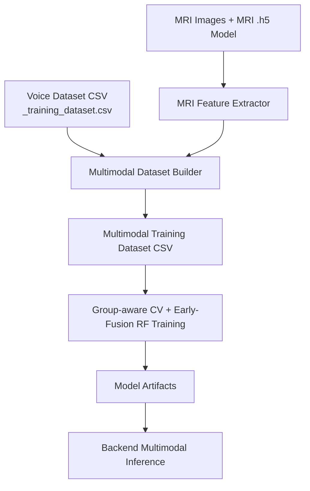

# Multimodal MRI + Voice Workflow Explanation

## Overview
This document explains the full multimodal pipeline implemented in this repository for combining:
- Voice-derived clinical speech features
- MRI image-derived probability features

The objective is to improve robustness by fusing complementary signals and training an early-fusion Random Forest model.

## High-Level Architecture

## Inputs

### Voice Input
- Source file: _training_dataset.csv
- Core features:
  - pause_count
  - total_speech_time
  - total_pause_time
  - mean_word_duration
  - speech_rate_wpm
  - pause_per_word_ratio
- Labels present in voice data:
  - Control (0)
  - MCI (1)

### MRI Input
- Image root: Alzheimers-Disease-Classification/Combined Dataset/train
- MRI model file: Alzheimers-Disease-Classification/Somesh_VGG16.h5 (with compatibility fallback logic)
- MRI class folders used:
  - No Impairment
  - Very Mild Impairment
  - Mild Impairment
  - Moderate Impairment

## Step-by-Step Process

## 1) Environment Setup and Reproducibility
Notebook sets deterministic seeds and verifies package availability before any training stage.

What it checks:
- pandas
- numpy
- sklearn
- joblib
- tensorflow
- pillow
- matplotlib
- seaborn

## 2) Path and Runtime Configuration
Defines all configurable input/output locations and creates output directories when missing.

Main runtime paths:
- classification/mri_feature_table.csv
- classification/multimodal_training_dataset.csv
- model_artifacts/multimodal
- backend/model_artifacts/multimodal

## 3) Voice and MRI Input Validation
Before expensive processing, schema and file/folder presence are validated.

Checks include:
- Required voice columns exist
- MRI model file exists
- MRI class folders exist

## 4) MRI Probability Feature Extraction
Implementation file:
- classification/mri_feature_extractor.py

Each MRI image is converted to a feature row containing:
- mri_prob_mild_impairment
- mri_prob_moderate_impairment
- mri_prob_no_impairment
- mri_prob_very_mild_impairment
- mri_pred_class_idx

Output artifact:
- classification/mri_feature_table.csv

### MRI Model Compatibility Handling
Because some .h5 files were saved with different Keras versions, loader logic includes:
- Direct load attempt
- Config sanitization for incompatible keys like:
  - batch_shape
  - optional
- Fallback candidate model files in same folder

This significantly reduces cross-version model loading failures.

## 5) Multimodal Fusion Dataset Construction
Implementation file:
- classification/build_multimodal_dataset.py

Fusion policy currently used:
- Control (voice 0) -> No Impairment target
- MCI (voice 1) -> Very Mild Impairment target

For each voice row:
1. Select mapped MRI class pool
2. Sample MRI probability row
3. Merge voice + MRI features
4. Add metadata columns

Key metadata added:
- canonical_patient_id
- target_mri_class
- pairing_strategy
- target_4class
- split

Output artifact:
- classification/multimodal_training_dataset.csv

## 6) Group-Safe Split Validation
The workflow validates that no group leakage occurs between train and test by using canonical_patient_id grouping.

Validation checks:
- Group leakage count
- Null checks
- Split-wise class counts

## 7) Early-Fusion Random Forest Training
Implementation file:
- classification/train_multimodal_random_forest.py

Training strategy:
- Features: all non-metadata columns
- Model: Pipeline(StandardScaler + RandomForestClassifier)
- CV: StratifiedGroupKFold (group-aware)

Why this design:
- Reduces leakage from augmented patient variants
- Keeps preprocessing and model consistent

## 8) Evaluation
Test-set outputs include:
- classification report
- confusion matrix
- aggregate metrics:
  - cv_accuracy_mean
  - cv_f1_macro_mean
  - cv_f1_weighted_mean
  - cv_balanced_accuracy_mean

## 9) Artifact Export
Saved artifacts:
- model_artifacts/multimodal/multimodal_rf_model.pkl
- model_artifacts/multimodal/multimodal_feature_names.pkl
- model_artifacts/multimodal/multimodal_training_report.json

Artifacts are also copied to backend deployment location:
- backend/model_artifacts/multimodal

## 10) Backend Multimodal Inference
Backend files:
- backend/main.py
- backend/predict.py

Endpoint added:
- POST /predict/multimodal

Request contract:
- cha_file: transcript file
- mri_file: image file

Inference flow:
1. Extract voice features from transcript
2. Extract MRI probabilities from image
3. Merge features in trained feature order
4. Predict with multimodal model
5. Return prediction, confidence, and probabilities

## 11) True New-Data Inference in Notebook
Notebook includes external-file inference section that uses files outside the generated train/test rows.

It supports:
- Single external CHA + MRI prediction
- Mini-batch external MRI checks with one CHA

This demonstrates real inference behavior after training.

## Detailed Workflow Diagram

```mermaid
flowchart LR
    A1[Load Voice CSV] --> A2[Validate Voice Schema]
    B1[Load MRI Model + Image Folders] --> B2[Extract MRI Probabilities]
    B2 --> B3[Save MRI Feature Table]
    A2 --> C1[Map Voice Labels to MRI Target Classes]
    B3 --> C2[Sample MRI Features by Mapped Class]
    C1 --> D1[Merge Voice + MRI Features]
    C2 --> D1
    D1 --> D2[Assign canonical_patient_id]
    D2 --> D3[Deterministic Group Split]
    D3 --> E1[Train Group-aware RF Pipeline]
    E1 --> E2[Evaluate Test Metrics]
    E2 --> E3[Save Model + Feature Names + Report]
    E3 --> F1[Copy to Backend Artifacts]
    F1 --> F2[Serve via /predict/multimodal]
```

## Current Limitations and Notes

1. Label-space limitation
- Current mapping creates effective targets in classes 2 and 3 only.
- Result: model often behaves as binary within those mapped classes.

2. Pairing strategy limitation
- Fusion currently uses diagnosis-level pairing, not subject-level paired MRI and voice samples.
- This may inflate or distort expected real-world performance.

3. Recommendation for stronger clinical validity
- Use patient-level paired MRI+voice records.
- Retrain with all intended classes represented in the fused dataset.

## Suggested Next Improvements

1. Introduce true patient-level mapping file
- patient_id -> MRI image path(s)

2. Expand training target coverage
- Ensure all 4 target classes are represented in fusion targets

3. Add explicit inference utility script
- Single command-line tool for new external data prediction

4. Add calibration and reliability analysis
- Probability calibration plots
- Threshold analysis

5. Add API contract examples
- End-to-end request and response samples for frontend integration

## File Index
- classification/multimodal_full_pipeline.ipynb
- classification/mri_feature_extractor.py
- classification/build_multimodal_dataset.py
- classification/train_multimodal_random_forest.py
- backend/predict.py
- backend/main.py
- _training_dataset.csv
