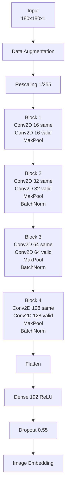
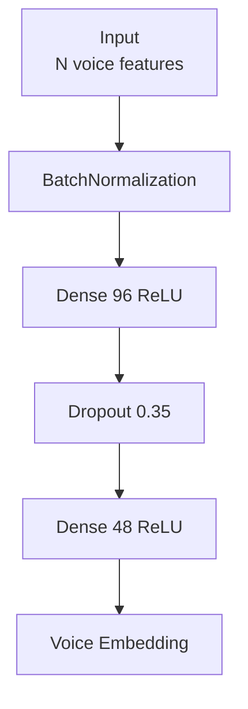
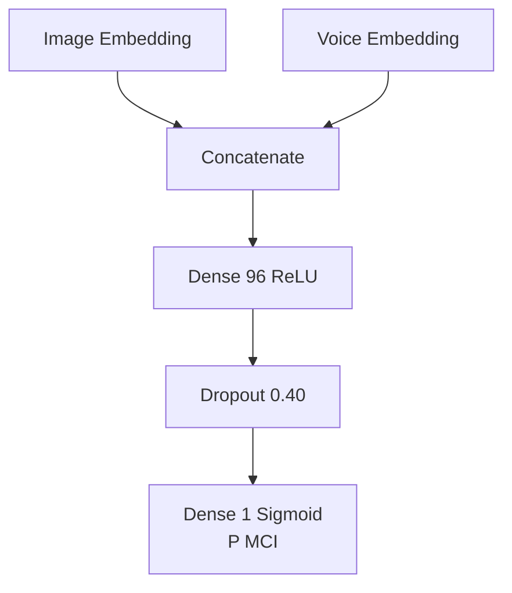
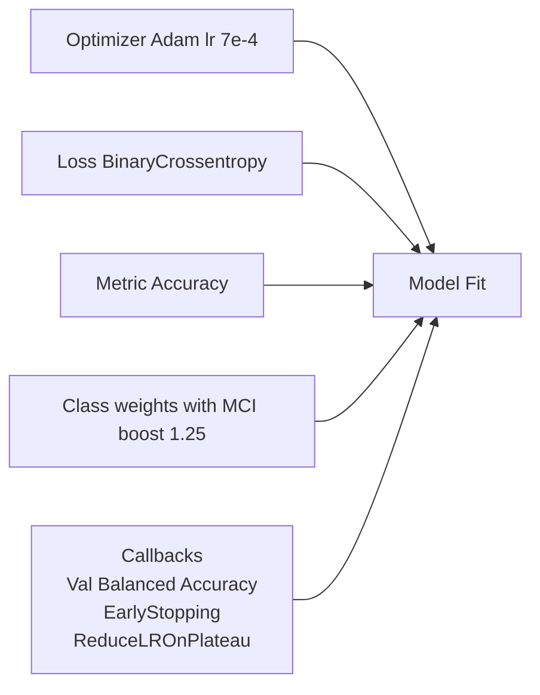

# CNN + CHA Fusion v2: Layer-by-Layer Block Diagrams

This file focuses only on model architecture blocks, with each layer shown in chart/flow format.

Source architecture:
- cnn_cha_fusion/cnn_cha_fusion_pipeline_v2.ipynb

---

## 1) Complete Model Graph (All Layers)

```mermaid
flowchart LR
    %% Inputs
    I0[image_input\nShape: 180x180x1]
    V0[voice_input\nShape: N_voice_features]

    %% Image branch
    I1[data_augmentation\nRandomFlip horizontal\nRandomRotation 0.04\nRandomZoom 0.08\nRandomContrast 0.08]
    I2[Rescaling 1/255]
    I3[Conv2D 16, 3x3, same, ReLU, L2]
    I4[Conv2D 16, 3x3, valid, ReLU, L2]
    I5[MaxPooling2D]

    I6[Conv2D 32, 3x3, same, ReLU, L2]
    I7[Conv2D 32, 3x3, valid, ReLU, L2]
    I8[MaxPooling2D]
    I9[BatchNormalization]

    I10[Conv2D 64, 3x3, same, ReLU, L2]
    I11[Conv2D 64, 3x3, valid, ReLU, L2]
    I12[MaxPooling2D]
    I13[BatchNormalization]

    I14[Conv2D 128, 3x3, same, ReLU, L2]
    I15[Conv2D 128, 3x3, valid, ReLU, L2]
    I16[MaxPooling2D]
    I17[BatchNormalization]

    I18[Flatten\nname=image_flatten]
    I19[Dense 192 ReLU L2]
    I20[Dropout 0.55]

    %% Voice branch
    V1[BatchNormalization]
    V2[Dense 96 ReLU L2]
    V3[Dropout 0.35]
    V4[Dense 48 ReLU L2]

    %% Fusion head
    F1[Concatenate\nname=flatten_voice_fusion]
    F2[Dense 96 ReLU L2]
    F3[Dropout 0.40]
    F4[Dense 1 Sigmoid]

    %% Connections
    I0 --> I1 --> I2 --> I3 --> I4 --> I5 --> I6 --> I7 --> I8 --> I9 --> I10 --> I11 --> I12 --> I13 --> I14 --> I15 --> I16 --> I17 --> I18 --> I19 --> I20 --> F1
    V0 --> V1 --> V2 --> V3 --> V4 --> F1
    F1 --> F2 --> F3 --> F4
```

---

## 2) Image Branch Only (Detailed CNN Stack)

---

## 3) Voice Branch Only (Tabular MLP Stack)

---

## 4) Fusion Head Only

---

## 5) Layer Order as Blocks (Keras Build Sequence)

### Image pathway order
1. Input(shape=(180, 180, 1), name=image_input)
2. Data augmentation (flip, rotation, zoom, contrast)
3. Rescaling(1/255)
4. Conv2D(16, same, relu, l2)
5. Conv2D(16, valid, relu, l2)
6. MaxPooling2D
7. Conv2D(32, same, relu, l2)
8. Conv2D(32, valid, relu, l2)
9. MaxPooling2D
10. BatchNormalization
11. Conv2D(64, same, relu, l2)
12. Conv2D(64, valid, relu, l2)
13. MaxPooling2D
14. BatchNormalization
15. Conv2D(128, same, relu, l2)
16. Conv2D(128, valid, relu, l2)
17. MaxPooling2D
18. BatchNormalization
19. Flatten(name=image_flatten)
20. Dense(192, relu, l2)
21. Dropout(0.55)

### Voice pathway order
1. Input(shape=(len(voice_feature_cols),), name=voice_input)
2. BatchNormalization
3. Dense(96, relu, l2)
4. Dropout(0.35)
5. Dense(48, relu, l2)

### Fusion head order
1. Concatenate(name=flatten_voice_fusion)
2. Dense(96, relu, l2)
3. Dropout(0.40)
4. Dense(1, sigmoid)

---

## 6) Training-Time Components (Not Layers, but part of model behavior)

These are not neural layers, but they control how the above layer graph is trained.
