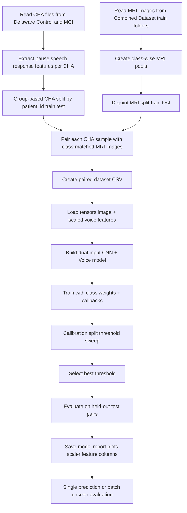
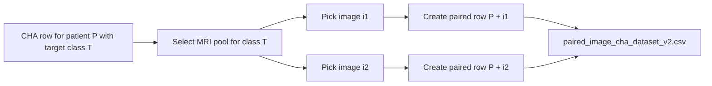
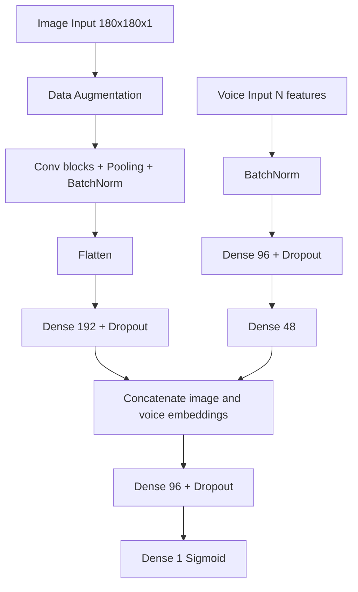
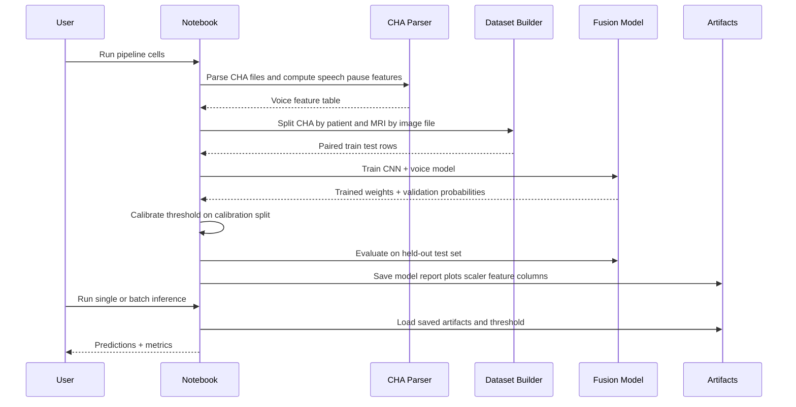

# CNN + CHA Fusion Pipeline Guide (End-to-End)

This document explains the full pipeline used in your project for multimodal dementia classification using:
- MRI image data (CNN branch)
- CHA transcript-derived speech timing features (tabular branch)

It describes:
1. How raw data is read
2. How paired datasets are created
3. How train/validation/test splitting is done
4. How the dual-input model is trained
5. How threshold tuning is performed
6. How inference and unseen evaluation are run
7. What artifacts are saved

---

## 1) Goal of This Pipeline

Binary classification:
- Class 0: Control
- Class 1: MCI

Fusion strategy:
- Image branch learns visual representation from MRI slices
- Voice branch learns statistical speech patterns from CHA files
- Both embeddings are concatenated and classified jointly

---

## 2) Data Sources and Folder Mapping

### CHA source folders
- Delaware/Control/*.cha
- Delaware/MCI/*.cha

### MRI source folders used in v2 training notebook
- Alzheimers-Disease-Classification/Combined Dataset/train/No Impairment/*
- Alzheimers-Disease-Classification/Combined Dataset/train/Mild Impairment/*

### Label mapping used for pairing
- Control (0) -> No Impairment
- MCI (1) -> Mild Impairment

This mapping is explicitly defined in the notebook and drives pair generation.

---

## 3) High-Level Pipeline Flowchart

---

## 4) CHA Feature Extraction (How speech data is created)

Feature extraction function:
- extract_cha_features(...)

Parser used:
- pause_cha_word_by_word.get_report(...)

For each .cha file, the pipeline computes:
- word_count
- pause_count
- total_speech_time
- total_pause_time
- total_duration
- speech_rate_wpm
- pause_per_word_ratio
- pause_per_speech_sec
- mean_word_duration
- std_word_duration
- mean_silence_duration
- std_silence_duration
- max_silence_duration
- silence_ratio
- response_time_count
- response_time_mean
- response_time_std
- response_time_median
- patient_id (derived from CHA filename stem)
- cha_file (source path)

A label is attached:
- target = 0 for Control CHA
- target = 1 for MCI CHA

---

## 5) Split Strategy (Leakage-Reduced Design)

The notebook intentionally reduces leakage in two places.

### 5.1 CHA split is patient-group based
Method:
- GroupShuffleSplit with groups = patient_id

Effect:
- Same patient does not appear in both train and test for CHA-derived data.

### 5.2 MRI split is disjoint by file path
Method:
- Class-wise image list shuffled and split into train/test pools

Effect:
- MRI files in train pool do not appear in test pool.

---

## 6) Pairing Strategy (How multimodal rows are created)

After split:
- For each CHA row, choose MRI only from the mapped class pool
- Repeat pairing PAIRS_PER_CHA times

In v2 notebook constants:
- PAIRS_PER_CHA = 2
- TEST_SIZE = 0.2
- MAX_IMAGES_PER_CLASS = 300

Created columns in paired dataset include:
- split (train/test)
- image_path
- target
- patient_id
- expected_mri_class
- all voice feature columns

Output file:
- cnn_cha_fusion/data/paired_image_cha_dataset_v2.csv

Observed report counts in saved v2 run:
- train_rows: 2108
- test_rows: 528

---

## 7) Dataset Creation Diagram

---

## 8) Input Tensor Preparation

### 8.1 Image preprocessing
- Read image with PIL
- Convert to grayscale
- Resize to IMG_SIZE x IMG_SIZE (v2: 180 x 180)
- Normalize to [0, 1]
- Add channel dimension

### 8.2 Voice preprocessing
- Select numeric voice feature columns
- Fit StandardScaler on train voice matrix
- Transform train and test voice matrices

### 8.3 Target vectors
- y_train, y_test from target column

### 8.4 Validation creation inside train split
- GroupShuffleSplit on train rows by patient_id
- Produces subtrain and validation
- Validation further split into:
  - monitor split for early stopping and LR scheduling
  - calibration split for threshold tuning only

This design avoids tuning threshold on the same validation samples used by callbacks.

---

## 9) Model Architecture (CNN + Voice Fusion)

Important regularization and training settings:
- L2 kernel regularization
- Dropout in both branches and fusion head
- Data augmentation on image branch
- Adam optimizer with learning rate 7e-4
- Binary cross entropy loss
- Accuracy metric

---

## 10) Training Process

### 10.1 Class weighting
Base class weights computed from subtrain distribution.
Then MCI class is boosted:
- MCI_WEIGHT_BOOST = 1.25

Purpose:
- Encourage MCI recall and prevent collapse to majority behavior.

### 10.2 Callback strategy
- Custom callback computes validation balanced accuracy (val_bal_acc)
- EarlyStopping monitors val_bal_acc (mode max, patience 3)
- ReduceLROnPlateau monitors val_loss

### 10.3 Fit call
Model is trained using:
- Inputs: [X_img_subtrain, X_voice_subtrain]
- Labels: y_subtrain
- Validation: monitor split only
- Epochs: 5 (in this v2 notebook run)
- Batch size: 32
- Class weights applied

---

## 11) Threshold Calibration (Critical Step)

After training, threshold is not fixed at 0.5.
A sweep is performed on calibration split probabilities.

Sweep range:
- thresholds from 0.05 to 0.80

Per-threshold metrics:
- recall_control
- recall_mci
- precision_mci
- balanced_acc
- macro_f1
- recall_gap

Selection logic:
1. Prefer thresholds meeting both recall targets:
   - target_recall_mci = 0.70
   - target_recall_control = 0.70
2. If none meet targets, use fallback objective favoring MCI recall while penalizing class gap.

Saved v2 selected threshold:
- best_threshold = 0.18

---

## 12) Evaluation Outputs (from saved v2 report)

From artifacts/cnn_cha_fusion_v2_report.json:
- test_accuracy_raw_0_5: 0.7538
- test_mci_precision: 0.7042
- test_mci_recall: 0.7519
- test_control_recall: 0.6794
- confusion_matrix: [[178, 84], [66, 200]]

Also saved:
- training curves plot
- confusion matrix heatmap

---

## 13) Artifacts Produced

Model and report:
- cnn_cha_fusion/artifacts/cnn_cha_fusion_v2.keras
- cnn_cha_fusion/artifacts/cnn_cha_fusion_v2_report.json

Visuals:
- cnn_cha_fusion/artifacts/cnn_cha_fusion_v2_training_curves.png
- cnn_cha_fusion/artifacts/cnn_cha_fusion_v2_confusion_matrix.png

Data tables:
- cnn_cha_fusion/data/paired_image_cha_dataset_v2.csv
- cnn_cha_fusion/data/cha_voice_features.csv

Runtime helpers used by inference:
- cnn_cha_fusion/artifacts/voice_scaler.pkl
- cnn_cha_fusion/artifacts/voice_feature_columns.pkl

---

## 14) Inference and Unseen Evaluation

Script:
- cnn_cha_fusion/test_unseen_cnn_cha_fusion.py

Modes:
- predict: one CHA + one MRI sample
- eval: many pairs from folder pools

Inference flow:
1. Load model + scaler + feature columns + threshold from artifacts
2. Extract CHA features for each .cha
3. Build voice vector and apply scaler
4. Load MRI image and preprocess
5. Predict probability P(MCI)
6. Apply threshold from report (unless overridden)

Batch eval output CSV:
- cnn_cha_fusion/data/unseen_eval_predictions.csv
or
- cnn_cha_fusion/artifacts/cnn_cha_fusion_v2_unseen_batch_predictions.csv (from notebook batch cell)

---

## 15) End-to-End Sequence Diagram

---

## 16) Important Practical Notes

1. Patient leakage prevention is done on CHA side using grouped split by patient_id.
2. MRI pairing is class-consistent by explicit mapping.
3. Threshold is calibrated for class balance and MCI recall goals, not fixed at 0.5.
4. If scaler or feature column artifacts are missing, inference scripts cannot reliably run after restart.
5. In the notebook, image data is normalized in loader and again rescaled in model input. Keep this behavior consistent when comparing old and new results.

---

## 17) Minimal Reproduction Checklist

1. Ensure CHA and MRI folders exist at expected paths.
2. Run notebook cells in order from imports to training to calibration.
3. Confirm artifacts are saved in cnn_cha_fusion/artifacts.
4. Run inference cell or test_unseen_cnn_cha_fusion.py for predict/eval.
5. Review report JSON and confusion matrix image for final behavior.

---

## 18) Quick File Map for This Pipeline

Core pipeline notebook:
- cnn_cha_fusion/cnn_cha_fusion_pipeline_v2.ipynb

Inference and unseen testing:
- cnn_cha_fusion/test_unseen_cnn_cha_fusion.py

Related multimodal data builder utility (separate tabular fusion workflow):
- classification/build_multimodal_dataset.py

---

If you want, I can also generate a second version of this guide that is line-by-line mapped to each notebook cell number (Cell 1 to Cell 9) so you can follow execution exactly while running it.